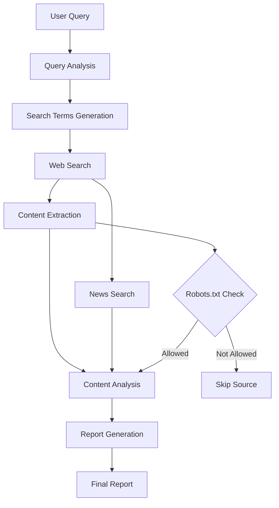

# AI Web Research Agent 🔍

An intelligent web research assistant that automatically searches, analyzes, and synthesizes information from across the internet to create comprehensive research reports.
## App link - https://researchagent-tbbjlfwy497vfsn2pwjjno.streamlit.app/
## Overview

The AI Web Research Agent is a powerful tool that helps users conduct efficient web research by:
- Automatically searching multiple web sources
- Analyzing and extracting relevant content
- Generating well-structured research reports
- Maintaining research history
- Providing source citations
- Respecting robots.txt guidelines
- Aggregating recent news

## Features

- 🤖 Intelligent query analysis and expansion
- 🌐 Automated web searching with robots.txt compliance
- 📰 News aggregation and filtering
- 📊 Smart content extraction and analysis
- 📝 Comprehensive report generation
- 🔍 Source tracking and citation
- 💾 Research history management
- ⚡ Result caching for better performance

## Prerequisites

- Python 3.8 or higher
- Groq API key
- Internet connection

## Installation

1. Clone the repository
2. Install required packages:

pip install -r requirements.txt

## Key Components

- Research Agent : Core component handling research workflow
- Search Tool : Manages web searches and result retrieval
- Content Processor : Handles content extraction and analysis
- Cache Manager : Optimizes performance through result caching

## Contributing
Contributions are welcome! Please feel free to submit a Pull Request.

## License
This project is licensed under the MIT License.

## Architecture

ai-web-research-agent/
├── src/
│   ├── agents/
│   │   └── research_agent.py
│   ├── tools/
│   │   ├── search_tool.py
│   │   ├── news_aggregator.py
│   │   ├── robots_checker.py
│   │   └── cache_manager.py
│   └── utils/
│       ├── config.py
│       └── logger.py
├── tests/
│   └── test_research_agent.py
├── app.py
├── requirements.txt
└── README.md

### Flow Diagram

### Component Interaction
- Query Analysis → Search Terms → Web Search
- Web Search → Content Extraction → Analysis
- Analysis → Report Generation

### Error Handling
- Website unreachable: Fallback to alternative sources
- Rate limiting: Implement backoff strategy
- Conflicting information: Cross-reference multiple sources

## Tool Documentation

### Search Tool
- Input: Query string, search parameters
- Output: URLs, snippets, metadata
- Usage: Primary source discovery

### Content Processor
- Input: URLs, raw HTML
- Output: Structured content, analysis
- Usage: Information extraction and validation

### Cache Manager
- Input: Query, results
- Output: Cached research reports
- Usage: Performance optimization